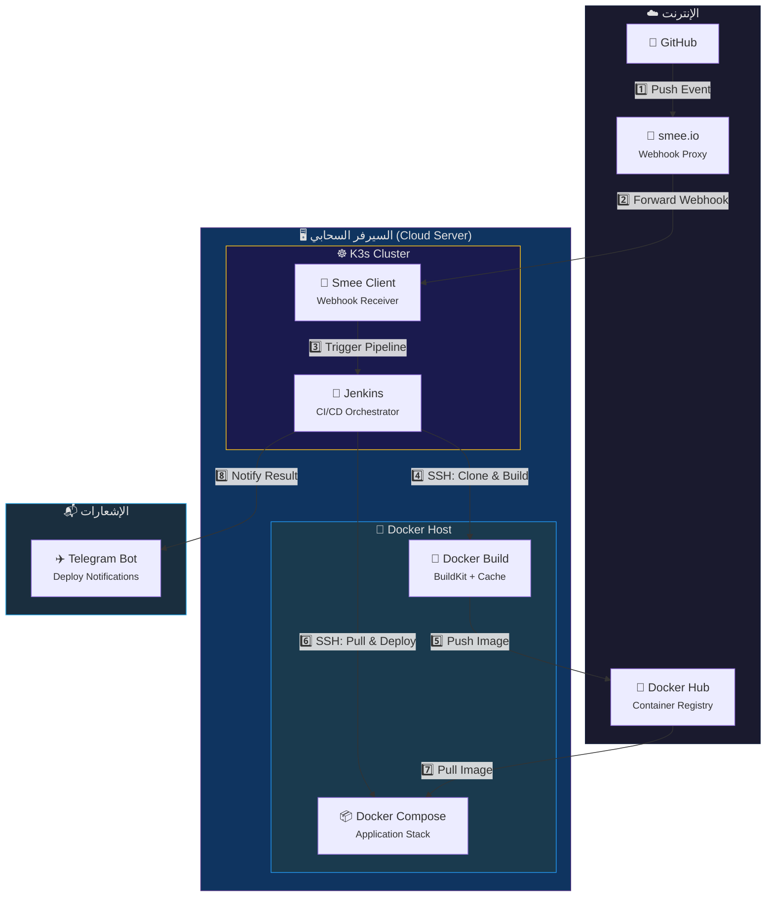

<p align="center">
  
  
  
  
  
</p>

<h1 align="center">🚀 Hybrid CI/CD Pipeline</h1>
<h3 align="center">Jenkins (K3s) ➜ Docker Host ➜ Production</h3>

<p align="center">
  <em>معمارية متقدمة وخفيفة لعمليات التكامل والتسليم المستمر (CI/CD) مخصصة للسيرفرات السحابية الفردية</em>
</p>

---

## 📖 نظرة عامة

يقدم هذا المستودع حلاً عملياً ومتكاملاً لبناء خط أنابيب CI/CD احترافي على سيرفر سحابي واحد. يعتمد الإعداد على تشغيل **Jenkins** داخل بيئة **K3s (Kubernetes)** للاستفادة من قدرات الاستشفاء الذاتي وإدارة الموارد، بينما تتم عمليات **بناء الصور ونشرها (Build & Deploy)** مباشرة على السيرفر المضيف (Host) عبر **Docker**، مع تخطي عوائق الشبكات الخاصة باستخدام **smee.io** كقناة Webhook آمنة.

يتضمن الـ Pipeline نظام **إشعارات Telegram** مدمج يُرسل تنبيهات فورية عند نجاح أو فشل عمليات النشر.

---

## 🏛️ المعمارية (Architecture)



---

## 🔄 مراحل الـ Pipeline

| المرحلة | الوصف | الأدوات |
|:---:|---|---|
| 🔍 **Pre-flight Checks** | التحقق من توفر Docker, Git, Docker Compose ومساحة القرص على السيرفر | `ssh`, `docker`, `git`, `df` |
| 📂 **Prepare Source Code** | سحب أحدث نسخة من الكود مع تنظيف التغييرات المحلية | `git fetch`, `git reset`, `git clean` |
| 🔨 **Build & Push** | بناء صورة Docker مع BuildKit ورفعها بـ 3 علامات (tags) إلى Registry | `docker build`, `docker push` |
| 🚀 **Deploy to Production** | سحب الصورة الجديدة وإعادة إنشاء الحاوية مع التحقق من حالتها | `docker compose pull`, `docker compose up` |
| 🏥 **Health Check** | فحص صحة التطبيق عبر HTTP مع إعادة المحاولة (6 محاولات) | `curl` |
| 🧹 **Cleanup** | تنظيف الصور المعلقة وكاش البناء القديم (أكثر من 7 أيام) | `docker image prune`, `docker builder prune` |
| ✈️ **Telegram Notify** | إرسال إشعار فوري بنتيجة النشر (نجاح ✅ أو فشل ❌) | `curl` → Telegram API |

---

## 🏗️ القرارات التصميمية

<details>
<summary><b>1️⃣ لماذا يتواجد Jenkins داخل K3s؟</b></summary>

- **الاستشفاء الذاتي (Self-healing):** إذا توقف Jenkins، يقوم K3s بإعادة تشغيله تلقائياً.
- **إدارة الموارد:** K3s يضمن عدم استهلاك Jenkins لموارد أكثر مما هو مخصص.
- **العزل (Isolation):** بقاء أدوات الإدارة معزولة عن ملفات وتطبيقات السيرفر المضيف.
- **التحديثات السهلة:** تحديث Jenkins يتم عبر تحديث Manifest بسيط.
</details>

<details>
<summary><b>2️⃣ لماذا نبني الصور على السيرفر وليس داخل K3s؟</b></summary>

- **مشكلة K3s و Docker:** بيئة K3s تعتمد على `containerd` ولا تحتوي على محرك Docker.
- **استهلاك الموارد:** بناء الصور داخل K3s (عبر Kaniko أو Pods مؤقتة) يستهلك ذاكرة ومعالج بشكل مفرط.
- **الحل — DooD عبر SSH:** Jenkins يتصل بالسيرفر عبر SSH ويستخدم Docker المثبت هناك.
- **كاش Docker:** استخدام Docker Cache على السيرفر المضيف يُسرّع البناء بشكل مضاعف.
</details>

<details>
<summary><b>3️⃣ لماذا نستخدم smee.io؟</b></summary>

- السيرفر محمي بشبكة خاصة (VPN/Tailscale) وغير متاح للإنترنت العام.
- هذا يمنع GitHub من إرسال Webhooks مباشرة إلى Jenkins.
- **الحل:** [smee.io](https://smee.io/) يعمل كقناة وسيطة — يستقبل الطلبات من GitHub، ويقوم عميل smee بسحبها وتمريرها داخلياً إلى Jenkins بدون فتح بورتات.
</details>

<details>
<summary><b>4️⃣ لماذا Docker Compose وليس Kubernetes للنشر؟</b></summary>

- `docker-compose` أسهل وأنسب للتطبيقات على سيرفر واحد.
- **قابل للتعديل:** يمكنك بسهولة تحويل مرحلة النشر لاستخدام `kubectl apply` إذا أردت النشر كـ Pods داخل K3s.
</details>

---

## 🛠️ المتطلبات (Prerequisites)

| المتطلب | الوصف | رابط |
|---|---|---|
| 🖥️ **سيرفر سحابي** | Ubuntu/Debian مع Docker مثبت | [Install Docker](https://docs.docker.com/engine/install/) |
| ☸️ **K3s** | مثبت على نفس السيرفر مع Jenkins | [Install K3s](https://k3s.io/) |
| 🔀 **smee.io** | قناة Webhook مع عميل smee مثبت على السيرفر | [smee.io](https://smee.io/) |
| 🐳 **Docker Hub** | حساب لرفع الصور (أو أي Registry آخر) | [Docker Hub](https://hub.docker.com/) |
| 🔑 **SSH Key** | مفتاح SSH للاتصال بالسيرفر المضيف من Jenkins | — |
| ✈️ **Telegram Bot** | بوت Telegram للإشعارات مع Chat ID | [إنشاء بوت](https://core.telegram.org/bots#how-do-i-create-a-bot) |

---

## ⚙️ دليل الإعداد (Setup Guide)

### الخطوة 1: إضافة بيانات الاعتماد في Jenkins

انتقل إلى **Manage Jenkins → Credentials → System → Global credentials → Add Credentials**

| النوع | ID | الوصف |
|---|---|---|
| `Username with password` | `docker-hub-creds` | بيانات Docker Hub (اسم المستخدم + كلمة المرور أو Access Token) |
| `SSH Username with private key` | `server-ssh-key` | مفتاح SSH للدخول إلى السيرفر المضيف |
| `Secret text` | `telegram-bot-token` | توكن بوت Telegram (للحماية من ظهوره في ملف Jenkinsfile) |

> [!IMPORTANT]
> **أمان توكن Telegram:** يتم تخزين توكن بوت Telegram كـ **Secret Text** في Jenkins Credentials بدلاً من كتابته مباشرة في ملف `Jenkinsfile`. هذا يضمن عدم ظهور التوكن في الكود المصدري أو سجلات البناء (Build Logs). الـ Pipeline يستخدم `credentials('telegram-bot-token')` لسحب التوكن بشكل آمن أثناء التشغيل.

<details>
<summary><b>📋 خطوات إضافة توكن Telegram في Jenkins</b></summary>

1. اذهب إلى **Manage Jenkins → Credentials → System → Global credentials**.
2. اضغط على **Add Credentials**.
3. اختر **Kind:** `Secret text`.
4. في حقل **Secret:** الصق توكن البوت (مثل `123456789:ABCdefGhIJKlmNoPQ...`).
5. في حقل **ID:** اكتب `telegram-bot-token` (يجب أن يتطابق مع ما في Jenkinsfile).
6. في حقل **Description:** اكتب وصفاً مثل `Telegram Bot Token for Deploy Notifications`.
7. اضغط **Create**.

</details>

<details>
<summary><b>📋 كيفية الحصول على Chat ID الخاص بالتلجرام</b></summary>

1. أرسل أي رسالة إلى البوت الخاص بك في Telegram.
2. افتح الرابط التالي في المتصفح (استبدل `YOUR_BOT_TOKEN` بتوكن البوت):
   ```
   https://api.telegram.org/botYOUR_BOT_TOKEN/getUpdates
   ```
3. ابحث عن `"chat":{"id":` في النتيجة — هذا هو الـ Chat ID.
4. للمجموعات: أضف البوت إلى المجموعة وأرسل رسالة، ثم كرر الخطوة 2 (Chat ID للمجموعات يبدأ بـ `-`).

</details>

### الخطوة 2: تعديل متغيرات البيئة

افتح ملف `Jenkinsfile` وعدّل قسم `environment` ليناسب مشروعك:

```groovy
environment {
    // ─── إعدادات الصورة والمستودع ───
    DOCKER_IMAGE    = 'your-dockerhub-username/your-app-name'
    GIT_REPO        = 'https://github.com/your-username/your-repo.git'
    GIT_BRANCH      = 'main'

    // ─── بيانات الاعتماد ───
    DOCKER_CREDS    = 'docker-hub-creds'
    SERVER_CREDS    = 'server-ssh-key'

    // ─── بيانات السيرفر ───
    SERVER_USER     = 'your_server_user'
    SERVER_IP       = '100.x.x.x'       // Tailscale IP or Public IP
    SSH_PORT        = '22'               // Your SSH port

    // ─── مسارات المجلدات ───
    BUILD_DIR       = '/home/your_server_user/jenkins_build_workspace'
    LIVE_DIR        = '/home/your_server_user/your-app-stack'
    APP_SERVICE     = 'your-app-service-name'  // Service name in docker-compose.yml

    // ─── Health Check ───
    HEALTH_URL      = 'https://your-domain.com'
    HEALTH_RETRIES  = '6'
    HEALTH_INTERVAL = '10'

    // ─── إشعارات Telegram ───
    TELEGRAM_TOKEN  = credentials('telegram-bot-token')  // Secret Text in Jenkins
    TELEGRAM_CHAT   = 'YOUR_TELEGRAM_CHAT_ID'
}
```

### الخطوة 3: إنشاء Pipeline في Jenkins

1. اذهب إلى **New Item** → اختر **Multibranch Pipeline** (أو Pipeline).
2. في قسم **Branch Sources** → أضف رابط مستودع GitHub.
3. في قسم **Build Configuration** → اختر **by Jenkinsfile**.
4. احفظ واترك smee.io يتولى تلقي الأحداث.

---

## ✈️ إشعارات Telegram

يقوم الـ Pipeline بإرسال إشعار فوري إلى Telegram عند انتهاء كل عملية نشر:

| الحالة | محتوى الإشعار |
|---|---|
| ✅ **نجاح** | اسم الصورة + رقم البناء + مدة التنفيذ |
| ❌ **فشل** | رقم البناء + رابط مباشر لسجلات الأخطاء في Jenkins |

> **ملاحظة أمنية:** التوكن يُسحب تلقائياً من Jenkins Credentials عبر `credentials('telegram-bot-token')` ولا يظهر أبداً في:
> - ملف `Jenkinsfile` (الكود المصدري)
> - سجلات البناء (Build Console Output) — يستبدله Jenkins بـ `****`
> - مستودع Git

---

## 🔧 استكشاف الأخطاء (Troubleshooting)

<details>
<summary><b>❌ فشل الاتصال بـ SSH</b></summary>

```bash
# تأكد من أن المفتاح الصحيح مضاف في Jenkins Credentials
# تأكد من أن البورت صحيح
ssh -p YOUR_PORT -i /path/to/key user@server-ip

# تأكد من أن المستخدم مضاف لمجموعة docker
sudo usermod -aG docker your-user
```
</details>

<details>
<summary><b>❌ فشل بناء الصورة (Docker Build)</b></summary>

```bash
# تأكد من وجود Dockerfile في المستودع
ls -la $BUILD_DIR/Dockerfile

# تأكد من مساحة القرص
df -h /

# تنظيف Docker cache
docker system prune -a --force
```
</details>

<details>
<summary><b>❌ فشل Health Check</b></summary>

```bash
# تأكد من أن التطبيق يعمل
docker compose ps

# اعرض سجلات التطبيق
docker compose logs --tail=100 your-app-service-name

# اختبر الرابط يدوياً
curl -v https://your-domain.com
```
</details>

<details>
<summary><b>❌ smee.io لا يعمل</b></summary>

```bash
# تأكد من تشغيل عميل smee
# يمكنك تشغيله كـ systemd service أو داخل K3s

# الأمر اليدوي:
npx smee-client -u https://smee.io/YOUR-CHANNEL -t http://JENKINS-URL/github-webhook/
```
</details>

<details>
<summary><b>❌ إشعارات Telegram لا تعمل</b></summary>

```bash
# 1. تأكد من أن التوكن صحيح ومحفوظ في Jenkins Credentials بـ ID: telegram-bot-token
# 2. تأكد من أن الـ Chat ID صحيح
# 3. اختبر يدوياً:
curl -s -X POST "https://api.telegram.org/botYOUR_TOKEN/sendMessage" \
    -d chat_id="YOUR_CHAT_ID" \
    -d text="Test message from server"

# 4. إذا كنت تستخدم مجموعة، تأكد من أن البوت مشرف (Admin) في المجموعة
# 5. تأكد من أن Jenkins يمكنه الوصول إلى api.telegram.org (لا يحظره الفايروول)
```
</details>

---

## 📁 هيكل المستودع

```
k3s-jenkins-hybrid-cicd/
│
├── 📄 Jenkinsfile          # خط الأنابيب الرئيسي (CI/CD Pipeline)
├── 📄 README.md            # هذا الملف
├── 📄 Dockerfile           # (في مستودع تطبيقك) ملف بناء الصورة
└── 📄 docker-compose.yml   # (على السيرفر) ملف تشغيل الخدمات
```

---

## 🤝 المساهمة

المساهمات مرحب بها! إذا كانت لديك أفكار لتحسين هذه المعمارية:

1. افتح **Issue** لطرح فكرتك أو مشكلتك.
2. أنشئ **Fork** ثم **Pull Request** مع وصف واضح.
3. تأكد من أن التغييرات تعمل بشكل صحيح قبل الإرسال.

---

## 📜 الترخيص

هذا المشروع مرخص تحت رخصة [MIT](https://opensource.org/licenses/MIT) — استخدمه بحرية في مشاريعك.

---

<p align="center">
  <sub>تم بناء هذه المعمارية بـ ❤️ لتوفير أفضل أداء وأعلى مستوى أمان للسيرفرات الفردية</sub>
  <br/>
  <sub>💡 <em>إذا أعجبك المستودع، لا تنسَ ⭐ النجمة!</em></sub>
</p>
